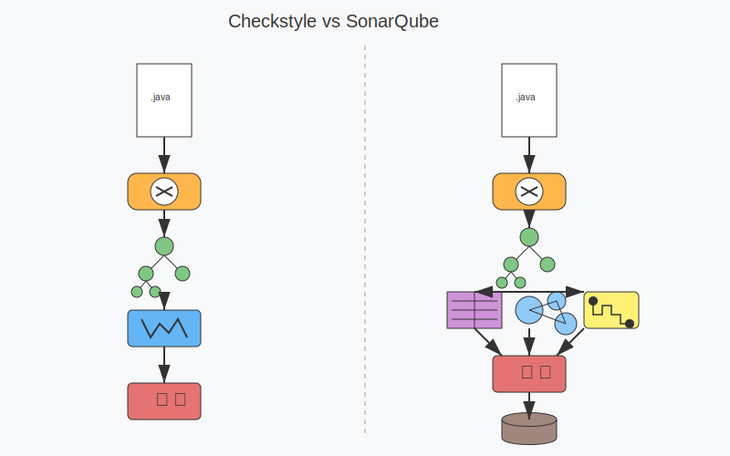
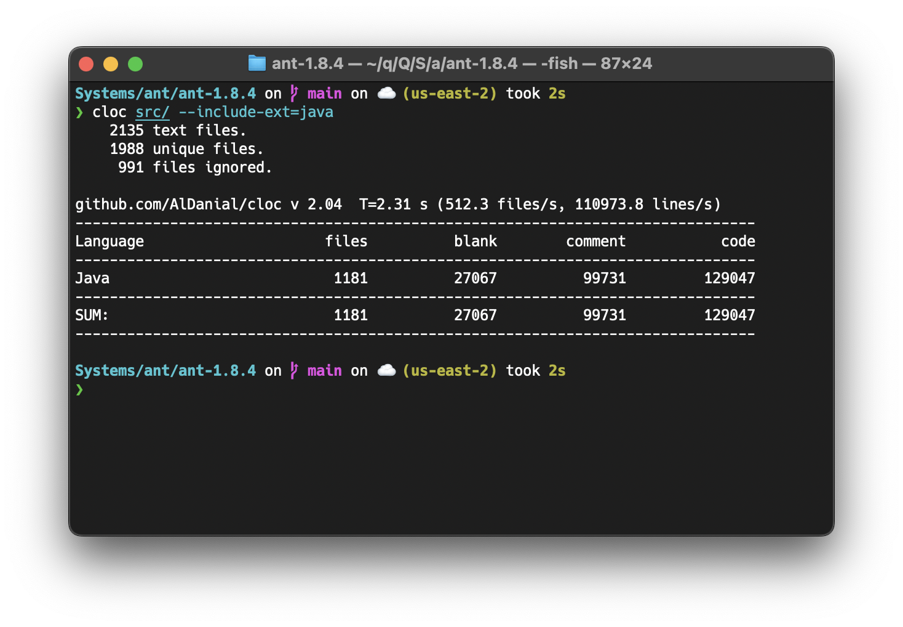

## 今週の活動
### Javaの保守性に関するルールの調査
#### SonarQube
- タグごとに整理されている
- ルール数の降順に並べたときの上位20件のタグを調査
- cert
	- セキュリティガイドライン（CERT）に関するルール
	- 例: Switch cases should end with an unconditional "break" statement
- convention
	- コーディング規約やスタイルダイドに関するルール
	- 例: Constant names should comply with a naming convention
- pitfall
	- よくあるミスに関するルール
	- エラーやメンテナンスの問題につながる可能性のあるコードを特定
	- 例: Octal values should not be used
- clumsy
	- 非効率なコードに関するルール
	- 目的を達成するために余分なステップが使われているコードを特定
	- 例: "Optional" should not be used for parameters
- tests
	- テストに関するルール
	- 例: Assertions should be complete
- suspicious
	- 不自然な構造を持つコードに関するルール
	- 例: "switch" statements should not contain non-case labels
- performance
	- ソフトウェアのパフォーマンスに影響を与えるコードに関するルール
	- 例: "String#replace" should be preferred to "String#replaceAll"
- cwe
	- Common Weakness Enumeration（CWE）に関するルール
	- 例: Exit methods should not be called
- confusing
	- 不必要に複雑で理解しにくいコードに関するルール
	- 例: Child class fields should not shadow parent class fields
- brain-overload
	- 認知的負荷に関するルール
	- 例: Cognitive Complexity of methods should not be too high
- error-handling
	- エラーハンドリングに関するルール
	- 例: Exceptions should not be thrown in finally blocks
- spring
	- Springフレームワークに関するルール
	- 例: Factory method injection should be used in "@Configuration" classes
- bad-practice
	- コーディングのベストプラクティスに反する行為に関するルール
	- 例: Execution of the Garbage Collector should be triggered only by the JVM
- unused
	- 宣言後に一度も使用されていないコードに関するルール
	- 例: Unused assignments should be removed
- java8
	- Java 8の機能とベストプラクティスに関するルール
	- 例: Try-with-resources should be used
- junit
	- JUnitに関するルール
	- 例: JUnit test cases should call super methods
- regex
	- 正規表現に関するルール
	- 例: Empty lines should not be tested with regex MULTILINE flag
- design
	- コードの設計に関するルール
	- 例: String literals should not be duplicated
- redundant
	- コード内の不必要な繰り返しや余分な要素に関するルール
	- 例: Assignments should not be redundant
- sustainability
	- 持続可能性に関するルール
	- 例: Bluetooth should be configured to use low power
- CheckstyleとSonarQubeの解析プロセスの概要
	- Checkstyle
		- AST（Abstract Syntax Tree）を利用
		- パーサーがそれぞれのJavaソースファイル全体をASTに変換
		-  Treewalkerクラスが、このASTをルールチェックを行う各サブモジュールに渡すことで、ソースファイルの様々な側面を検査
			- 例: LeftCurlyCheck, MethodLengthCheck, LineLengthCheck
		- ルールチェックを行う各サブモジュールはAbstractCheckクラスやAbstractFileSetCheckクラスから派生
			- AbstractCheck: メソッド、クラス、変数などのファイル内部の構造を分析
			- AbstractFileSetCheck: ファイルレベルでの検査を行う
	- SonarQube
		- 多言語に対応するために、言語ごとにアナライザーを提供
		- 多くのアナライザーはASTを使用して静的解析を行う
		- Javaのアナライザーの場合
			- Checkstyleと同様に、パーサーがASTを作成するが、それに加えて様々なグラフを作成して解析
	- 解析プロセスの相違点
		- Checkstyle
			- Javaソースファイルを読み込む
			- パーサーがASTを生成
			- TreeWalkerがASTをトラバースし、各ノードを訪問
			- ルールチェックを行う各モジュールが特定のノードタイプに対するチェックを実行
			- 違反を検出したら報告
		- SonarQube
			- Javaソースファイルを読み込む
			- パーサーがASTを生成
			- 変数、メソッド、クラスなどのシンボル情報を抽出し、シンボルテーブルを構築
				- シンボルテーブルとは、プログラミング言語の処理系（コンパイラ、インタープリタ、静的解析ツールなど）において、プログラム内で使用される識別子に関する情報を格納するデータ構造
				- シンボルテーブルを構築することで、識別子の使用パターン（呼び出しの有無や引数の誤り）を分析できる
			- 依存関係グラフを作成し、import文によるファイル間の依存関係を分析
			- 制御フローグラフを作成し、条件分岐やループなどのコードの実行パスを分析
			- 各種ルールを適用
			- 問題を検出し、結果をデータベースに保存



### SonarQubeによるant 1.8.4の静的解析
- javaソースファイルの行数の内訳
	- 空行: 27,067
	- コメント行: 99,731
	- コード行: 129,047



- プロジェクト全体の解析時間
	- timeコマンドで実行時間を計測した
		- 実行環境: M2 Pro
		- コードがユーザーモードでCPUを使用した時間: およそ87秒
		- コードがカーネルモードでCPUを使用した時間: およそ64秒
		- I/O待ち時間などを含めた実行時間の合計: およそ157秒
```
Executed in  157.05 secs    fish           external
   usr time   87.02 secs    0.26 millis   87.02 secs
   sys time   64.49 secs    2.00 millis   64.49 secs
```

## 得られた成果
- SonarQubeやCheckstyleが提供するルールにおける類似点
	- コードの命名規則や記述スタイルに関するルールを提供
		- SonarQubeの「convention」とCheckstyleの「Naming Conventions」
	- バグの原因となるコードパターンを検出
		- SonarQubeの「pitfall」、「bad-practice」とCheckstyleの「Coding」
	- コードの認知的複雑さを測定
		- SonarQubeの「brain-overload」とCheckstyleの「Metrics」
	- コードの冗長性を検出
		- SonarQubeの「redundant」とCheckstyleの「Coding」
	- 正規表現に関するルールを持つ
		- SonarQubeの「regex」とCheckstyleの「Regexp」
	- コードの肥大化を防ぐためのルールを提供
		- SonarQubeの「design」とCheckstyleの「Size Violations」
	- コードの読みやすさを改善するためのルールを提供
		- SonarQubeの「confusing」とCheckstyleの「Block」
- 異常検出アルゴリズムと組み合わせて利用すると効果的なルール
	- サイズ
		- Halsteadの複雑さの尺度では、プログラムの長さがプログラムの記述の難しさや読みにくさに影響
	- 複雑度
		- McCabeのサイクロマティック複雑度では、コードの分岐数が増えるほどテストの複雑さが増加
	- 結合度
		- Parnasによれば、モジュール間の結合度が低いほどモジュール性が高くなる
	- 重複度
		- 重複コードがあると特定の変更が他の重複箇所にも影響する可能性があるため、変更漏れのリスクが高まる
	- 依存性
		- Conwayの法則によれば、システムの構造は組織のコミュニケーション構造を反映するため、複雑な依存関係は変更コストを増大させる
- 異常検出アルゴリズムと組み合わせて利用しても効果が低いルール
	- コーディングスタイル、ドキュメンテーション
		- 二値的な違反（違反しているかしていないか）であるため、異常検出の統計的・確率的アプローチと相性が悪い
		- 例: 命名規則、インデントスタイル、メソッドに対するコメントの有無
	- クラス、メソッド、変数、テストなどの記述ミス
		- コンパイラやインタープリタが検出できる
		- 異常検出アルゴリズムを使用しなくとも、単純な静的解析で100%検出できる
		- 例：未使用の変数、到達不能なコード、構文エラー、テストコードの論理的な誤り
- 具体的な実装方法
	- パーサーで構文木を作成
	- グラフライブラリでコードの構造を表現
	- ソフトウェアメトリクスを計算
	- 異常検出アルゴリズムを適用
## 直面した課題
- 今後扱おうとしているメトリクスの重要性についての新しい裏付けを取る必要がある
	- 関連研究の追加調査を行う
- 静的解析においてASTとグラフ構造がどのように作られるかを説明する資料を作り、今後の検討に役立てる
## 来週の計画
- 関連研究の調査
- 本を読み、リファクタリングについての理解を深める
- 既存手法との比較を容易にするために、SonarQubeを用いた静的解析の時間を短縮できるか試す