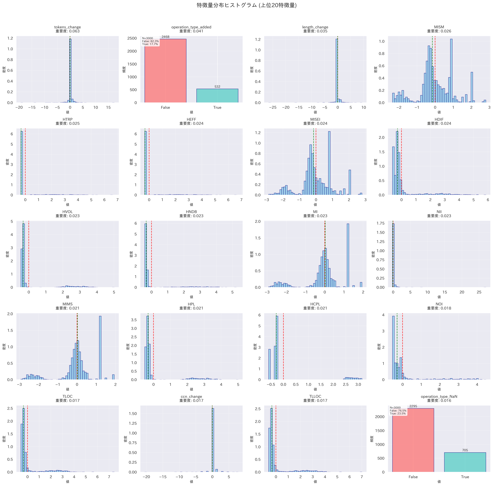
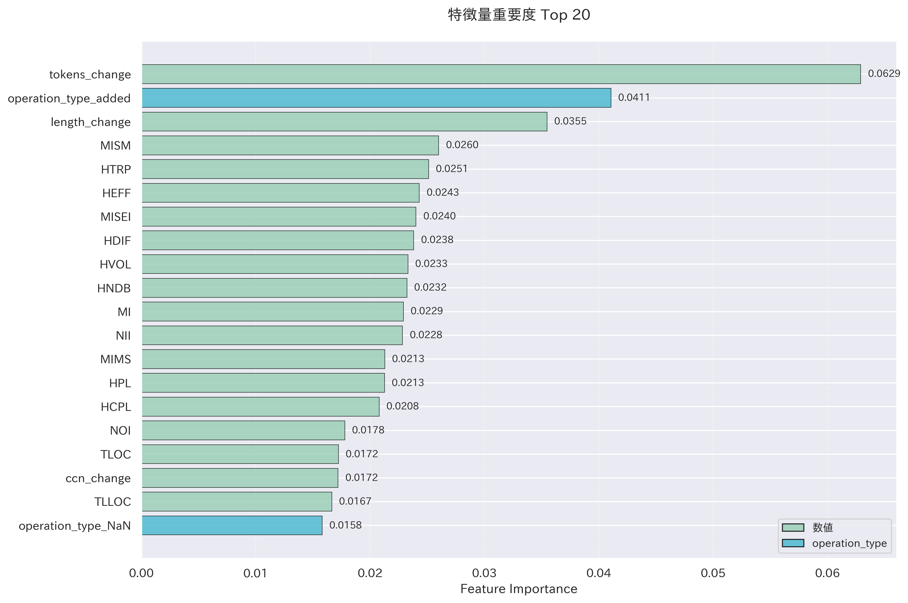
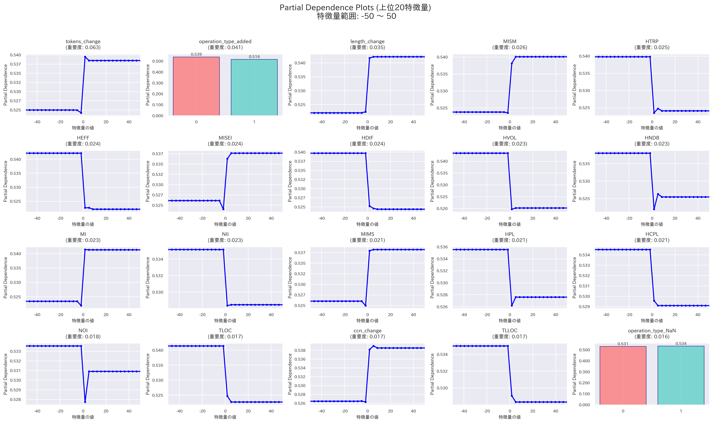

## 今週の活動
- 交絡因子の影響を測定するためのプログラムを作成
	- [lizard_analysis_current.py](https://github.com/nagutabby/bug-hunter/blob/3727c2a45b6eff87290a7784c074925739708ac4/remove/elasticsearch/lizard_analysis_current.py)
		- GitPythonで分析対象のコミットに移動
		- Javaのメソッドの完全な修飾子（Long name）をパースしてクラス名とメソッド名を抽出
		- 抽出した情報を用いて分析対象のJavaファイルを検索
		- 指定したJavaファイルが見つかったらlizardで絶対値メトリクス（循環的複雑度、コード行数、トークン数）を測定
	- [mcnemar_test.py](https://github.com/nagutabby/bug-hunter/blob/3727c2a45b6eff87290a7784c074925739708ac4/remove/elasticsearch/mcnemar_test.py)
		- マクネマー検定によって、特徴量エンジニアリングの効果を確認
			- マクネマー検定: 同じ対象に対して2回の測定を行った場合に、変化があったかどうかを検定する手法
			- データを2行2列の表に整理し、陽性から陰性に変化した数や、陰性から陽性に変化した数（非対角成分）を比較
			- 参考: https://bellcurve.jp/statistics/course/26830.html?srsltid=AfmBOoqQpOoGso-qQRAK4xoJs5r74Asg_Z_Wkoxgh_-0M7TdUnL8mgec
- 特徴量を分析するためのプログラムを作成
	- [analyzer.py](https://github.com/nagutabby/bug-hunter/blob/3727c2a45b6eff87290a7784c074925739708ac4/remove/elasticsearch/analyzer.py)
		- 上位n個の特徴量の分布をヒストグラムで可視化
		- Feature Importranceを用いて、ランダムフォレストにおける特徴量の重要度を横棒グラフで表示
		- 各特徴量が予測結果に与える影響をPartial Dependence Plot（PDP）で可視化
## 得られた成果
- マクネマー検定の結果、以下のことが分かった
	- メトリクスの変化量を追加したデータセットは、元のデータセットよりも有意に優れている（p値: 0.000001）
	- メトリクスの変化量を追加したデータセットは、メトリクスの絶対値を追加したデータセットよりも有意に優れている（p値: 0.000000）
- 各特徴量を分析するためのプログラムが完成

## 直面した課題
- データセットに存在する特徴量の数が多く、各特徴量の分析だけではランダムフォレストの予測理由を把握できない
	- 交互作用項の導入や決定木の可視化を検討
		- 交互作用項: 2つ以上の特徴量が組み合わさったときに生まれる効果を表す特徴量で、特徴量AとBの積で表される
		- 決定木: データを「はい/いいえ」形式の質問で段階的に分類する手法
			- if-then形式のルールで構成されるため、予測理由を理解しやすい
			- ランダムフォレストは多数の決定木の多数決による予測を行っているため、個々の決定木を分析することで、どのような基準で予測しているかが分かる
## 来週の計画
- 交互作用項の実装
- 決定木の可視化
- 特徴量の分析によって得られた新たな知見の整理