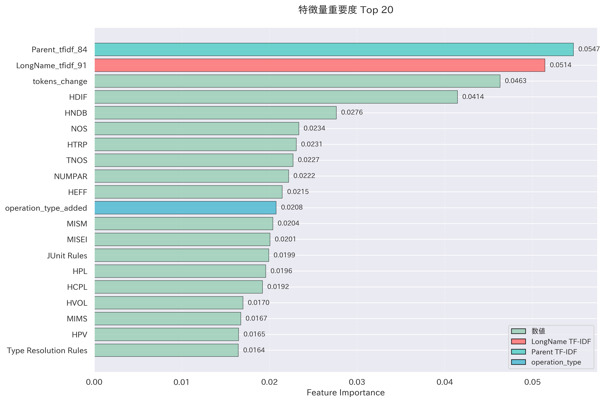
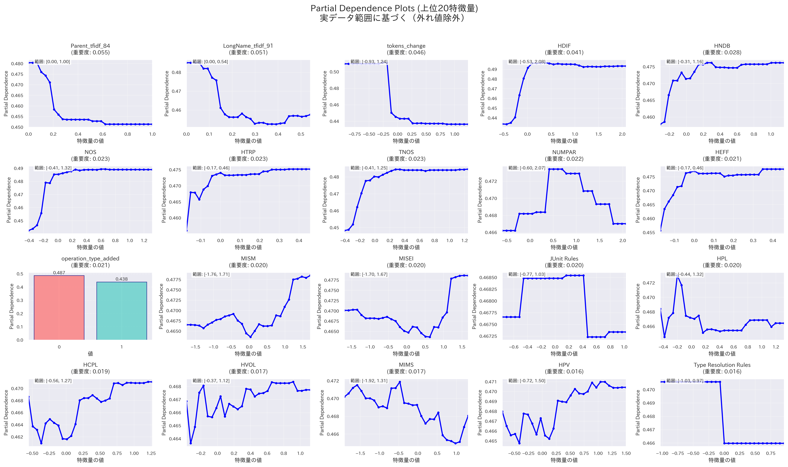

## 今週の活動
- それぞれのソフトウェアプロジェクトを分析
### antlr4
- 学習データ数: 164件（アンダーサンプリング後）
- テストデータ数: 169件
- マクネマー検定の結果
	- p値: およそ0.27
	- 有意差なし

| 指標（概算）    | 特徴量追加前 | 特徴量追加後 |
| :-------- | :----- | :----- |
| F1スコア     | 0.45   | 0.48   |
| Precision | 0.32   | 0.36   |
| Recall    | 0.76   | 0.76   |
| Accuracy  | 0.77   | 0.8    |
| ROC-AUC   | 0.82   | 0.87   |

#### 概要
- ParentやLongNameに含まれる特定の単語の重要度が高い
- メソッドのトークン数の変化が精度向上に寄与している
- HDIF、HNDB、HTRPなどのハルステッドメトリクスも重要

#### 概要
- 全体として分布の偏りが大きい
- 特定の領域に異なるクラスのデータポイントが密集することで、クラス間の分離が難しくなり、分類境界が曖昧になっている（モデルが細かな違いを学習できていない）

#### 概要
- トークン数の変化、HDIF、HNDB、NOS、HTRP、TNOS、HEFFは特定の範囲において陽性クラスの予測確率が高止まりしている
- NUMPAR、JUnit Rulesは凸型の変化が見られ、特定の値の前後では陽性クラスの予測確率が低下
- 全体として、特定の値以上か以下になると陽性クラスの予測確率が大きく増加

#### 概要
- LongName -> トークン数の変化（左） -> TCD（Total Comment Density、左）でジニ不純度がおよそ0.19となり、陽性クラスを高い確率で分類している
- LongName -> TLOC（Total Lines of Code、右） -> HDIF（Halstead Difficulty、左）でジニ不純度がおよそ0.07となり、陰性クラスを高い確率で分類している
### ceylon-ide-eclipse

## 得られた成果
## 直面した課題
## 来週の計画