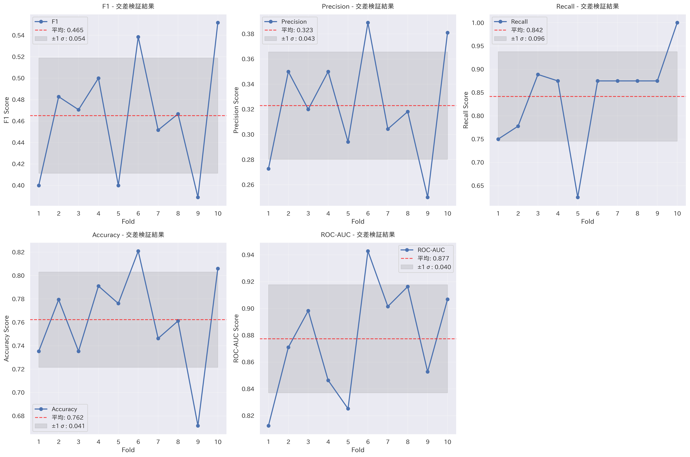
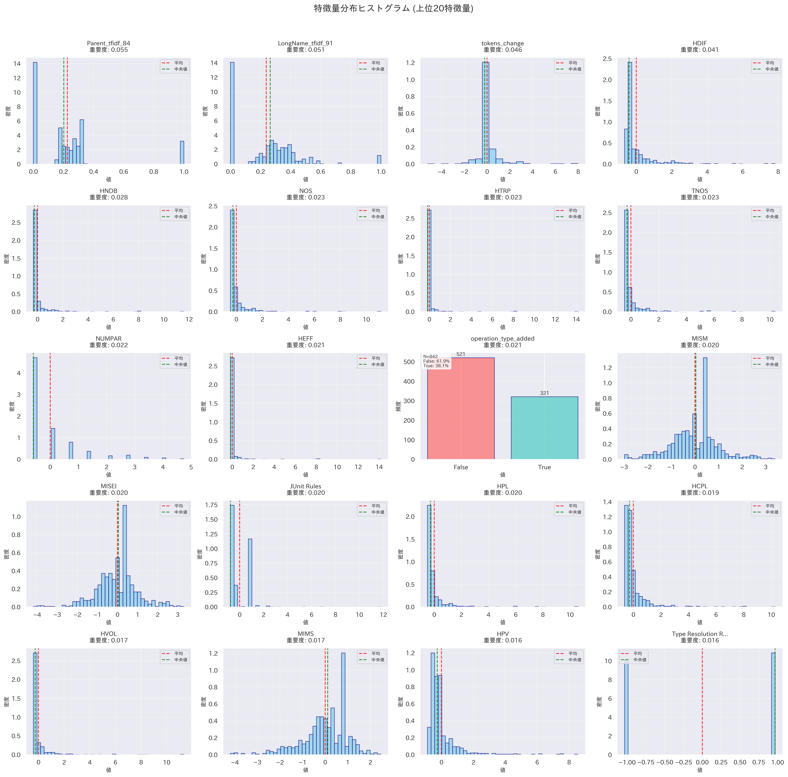
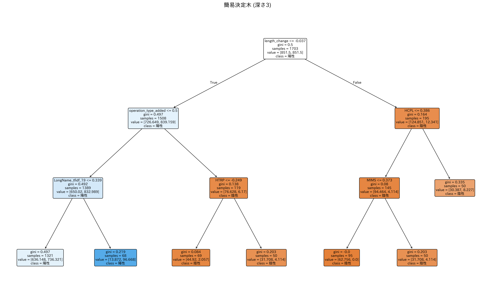
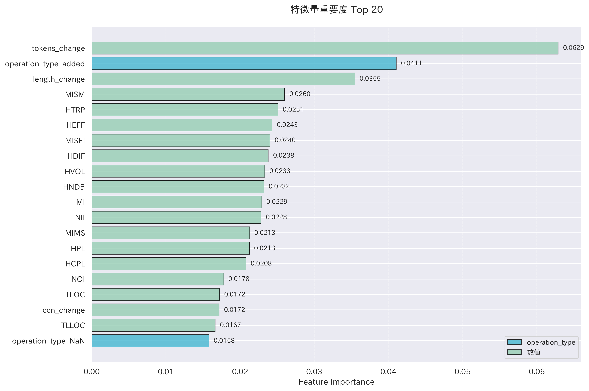
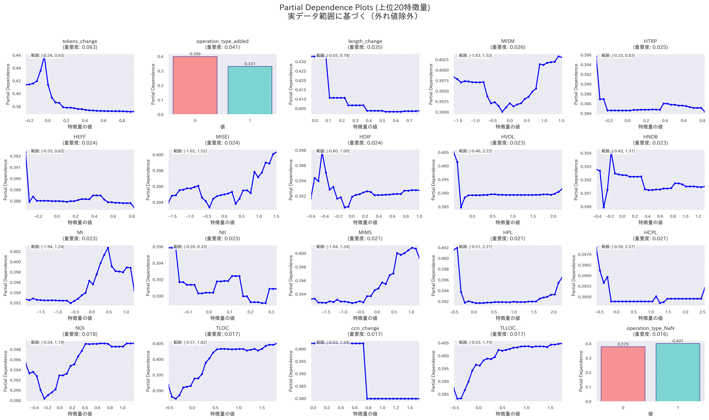
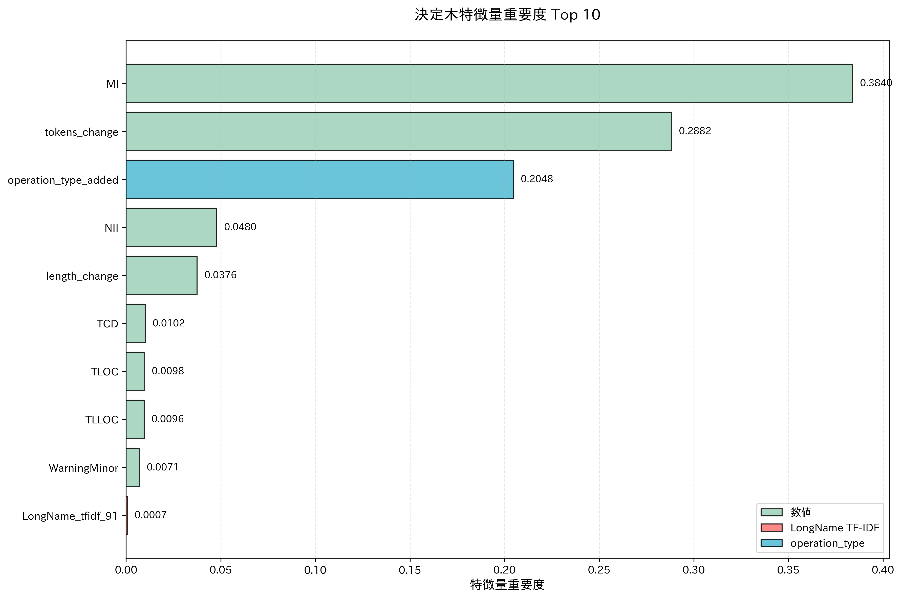
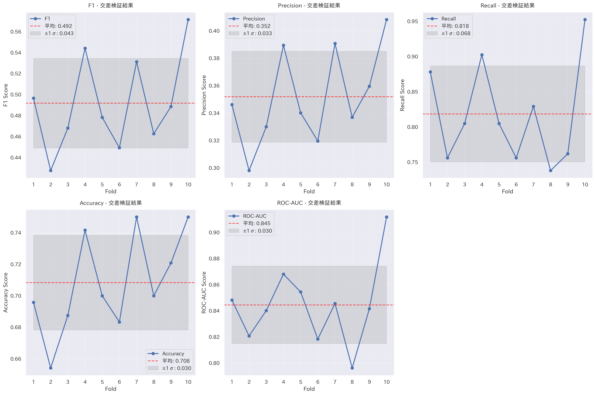

## 今週の活動
- それぞれのソフトウェアプロジェクトを分析
### antlr4
- 学習データ数: 164件（アンダーサンプリング後）
- テストデータ数: 169件
- マクネマー検定の結果
	- p値: およそ0.27
	- 有意差なし

| 指標（概算）    | 特徴量追加前 | 特徴量追加後 |
| :-------- | :----- | :----- |
| F1スコア     | 0.45   | 0.48   |
| Precision | 0.32   | 0.36   |
| Recall    | 0.76   | 0.76   |
| Accuracy  | 0.77   | 0.8    |
| ROC-AUC   | 0.82   | 0.87   |

#### 概要
- ParentやLongNameに含まれる特定の単語の重要度が高い
- メソッドのトークン数の変化が精度向上に寄与している
- HDIF、HNDB、HTRPなどのハルステッドメトリクスも重要

#### 概要
- 全体として分布の偏りが大きく、陰性クラスの特徴を明確に捉えている
- 特定の領域に異なるクラスのデータポイントが密集することで、クラス間の分離が難しくなり、分類境界が曖昧になっている（モデルが細かな違いを学習できていない）

#### 概要
- トークン数の変化、HDIF、HNDB、NOS、HTRP、TNOS、HEFFは特定の範囲において陽性クラスの予測確率が高止まりしている
- NUMPAR、JUnit Rulesは凸型の変化が見られ、特定の値の前後では陽性クラスの予測確率が低下
- 全体として、特定の値以上か以下になると陽性クラスの予測確率が大きく増加

#### 概要
- LongNameに含まれる特定の単語の重要度が0.139以下 -> トークン数の変化量が-0.136以下のときにジニ不純度がおよそ0.19となり、陽性クラスを高い確率で分類している
- LongNameに含まれる特定の単語の重要度が0.139以下ではない -> TLOC（Total Lines of Code）が-0.05以下のときにジニ不純度がおよそ0.07となり、陰性クラスを高い確率で分類している
### ceylon-ide-eclipse
- 学習データ数: 828件（アンダーサンプリング後）
- テストデータ数: 426件
- マクネマー検定の結果
	- p値: およそ0.000001
	- 有意差あり

| 指標（概算）    | 特徴量追加前 | 特徴量追加後 |
| :-------- | :----- | :----- |
| F1スコア     | 0.39   | 0.49   |
| Precision | 0.30   | 0.40   |
| Recall    | 0.56   | 0.65   |
| Accuracy  | 0.57   | 0.67   |
| ROC-AUC   | 0.60   | 0.69   |

#### 概要
- コード行数の長さの変化は最も重要度が高い
- Maintainability Index関連のメトリクス（MI, MISEI, MIMS, MISM）も重要度が高い
- ハルステッドメトリクス（HNDB, HTRP, HCPL, HEFFなど）が引き続き上位に位置している

#### 概要
- Maintainability Index関連のメトリクスは分散が大きい
- ハルステッドメトリクス、コード行数やトークン数の変化量は分散が比較的小さいため、それぞれの特徴量のみでクラスを分類するのは難しい

#### 概要
- Maintainability Index関連のメトリクス、一部のハルステッドメトリクス（HCPL、HVOL、HDIF、HPL、HPV）は凹型のグラフになっており、特定の値付近で陽性クラスの予測確率が低くなり、その前後で陽性クラスの予測確率が高くなっている
- コード行数の変化、トークン数の変化、HNDB、HTRP、HEFFのいずれかの値を変化させても、陽性クラスの予測確率にはあまり変化が見られない

#### 概要
- コード行数の変化量が-0.037以下 -> メソッド操作が「追加」 -> LongNameに含まれる特定の単語の重要度が0.339以下ではないときにジニ不純度がおよそ0.22となり、陽性クラスを高い確率で分類している
- コード行数の変化量が-0.037以下 -> メソッド操作が「追加」ではないときにジニ不純度が0.138となり、陰性クラスを高い確率で分類している
- コード行数の変化量が-0.037以下ではない -> HCPL（Halstead Calculated Program Length）が0.386以下のときにジニ不純度が0.08となり、陰性クラスを高い確率で分類している
### elasticsearch

- 学習データ数: 1604件（アンダーサンプリング後）
- テストデータ数: 600件
- マクネマー検定の結果
	- p値: およそ0.000001
	- 有意差あり

| 指標（概算）    | 特徴量追加前 | 特徴量追加後 |
| :-------- | :----- | :----- |
| F1スコア     | 0.62   | 0.72   |
| Precision | 0.51   | 0.61   |
| Recall    | 0.79   | 0.87   |
| Accuracy  | 0.67   | 0.77   |
| ROC-AUC   | 0.79   | 0.88   |

#### 概要
- トークン数やコード行数の変化量の重要度が高い
- メソッド操作が「追加」であるかどうかもクラス分類の判断に影響を与えている
- ハルステッドメトリクス、Maintainability Index関連のメトリクスもある程度の重要度がある

#### 概要
- トークン数、コード行数、循環的複雑度のいずれも変化量はほとんど0

#### 概要
- トークン数、コード行数の変化量が0付近であるほど陽性クラスの予測確率が高まる
- MISM、MISEIは凹型であり、0付近で陽性クラスの予測確率が最も低くなる

#### 概要
- MI（Maintainability Index）が0.56以下 -> メソッド操作が「追加」ではないときにジニ不純度が0.115となり、陰性クラスを高い確率で分類している
- MI（Maintainability Index）が0.56以下ではない -> NII（Number of Incoming Invocations）が0.371以下 -> トークン数の変化量が-0.092以下のときにジニ不純度が0.132となり、陰性クラスを高い確率で分類している
### BroadleafCommerce
- 学習データ数: 826件（アンダーサンプリング後）
- テストデータ数: 600件
- マクネマー検定の結果
	- p値: およそ0.45
	- 有意差なし

| 指標（概算）    | 特徴量追加前 | 特徴量追加後 |
| :-------- | :----- | :----- |
| F1スコア     | 0.46   | 0.45   |
| Precision | 0.32   | 0.32   |
| Recall    | 0.81   | 0.78   |
| Accuracy  | 0.67   | 0.68   |
| ROC-AUC   | 0.82   | 0.83   |

#### 概要
- ハルステッドメトリクス、Maintainability Index関連のメトリクスの重要度が高い
- 変化量メトリクスは特徴量の重要度上位20件に含まれていない

#### 概要
- MI、MISEI、MISM、MIMSに明確な二峰性があり、陽性クラスや陰性クラスの傾向を掴みにくい
- ハルステッドメトリクスの値が全体的に大きく、陽性クラスと陰性クラスの境界を設定しにくい

#### 概要
- ハルステッドメトリクスが一定の値以上になると陽性クラスの予測確率が高止まりする
	- ハルステッドメトリクスは重要度が高いが、数値的な重要度はあまり高くないことを示唆している

#### 概要
- 他のソフトウェアプロジェクトの決定木と比べて、陽性と予測されるノード数が多い
- Precisionが低いことから、偽陽性の原因となった条件式が多いことが分かる
### hazelcast
- 学習データ数: 1640件（アンダーサンプリング後）
- テストデータ数: 600件
- マクネマー検定の結果
	- p値: およそ0.004
	- 有意差あり

| 指標（概算）    | 特徴量追加前 | 特徴量追加後 |
| :-------- | :----- | :----- |
| F1スコア     | 0.67   | 0.71   |
| Precision | 0.58   | 0.63   |
| Recall    | 0.81   | 0.82   |
| Accuracy  | 0.73   | 0.77   |
| ROC-AUC   | 0.86   | 0.88   |

#### 概要
- トークン数やコード行数の変化量の重要度が高い
- ハルステッドメトリクスやMaintainability Index関連のメトリクスも重要度が高い

#### 概要
- ハルステッドメトリクス、トークン数やコード行数の変化量の分布は大きな偏りがある

#### 概要
- トークン数やコード行数の変化量は、0付近で最も陽性クラスの予測確率が高い
- ハルステッドメトリクスは特定の値以上になると陽性クラスの予測確率が高止まりする
- TNOS（Total Number of Statements）、TLOC（Total Lines of Code）は陽性クラスの予測確率と比例している

#### 概要
- NOI（Number of Outgoing Invocations）が-0.815以下 -> HEFFが-0.203以下のときにジニ不純度が0.145となり、陰性クラスを高い確率で分類している
- NOI（Number of Outgoing Invocations）が-0.815以下ではない -> メソッド操作が「追加」ではない -> MIMS（Maintainability Index （Microsoft version））が-0.629以下のときにジニ不純度が0.065となり、陰性クラスを高い確率で分類している

## 得られた成果
## 直面した課題
## 来週の計画