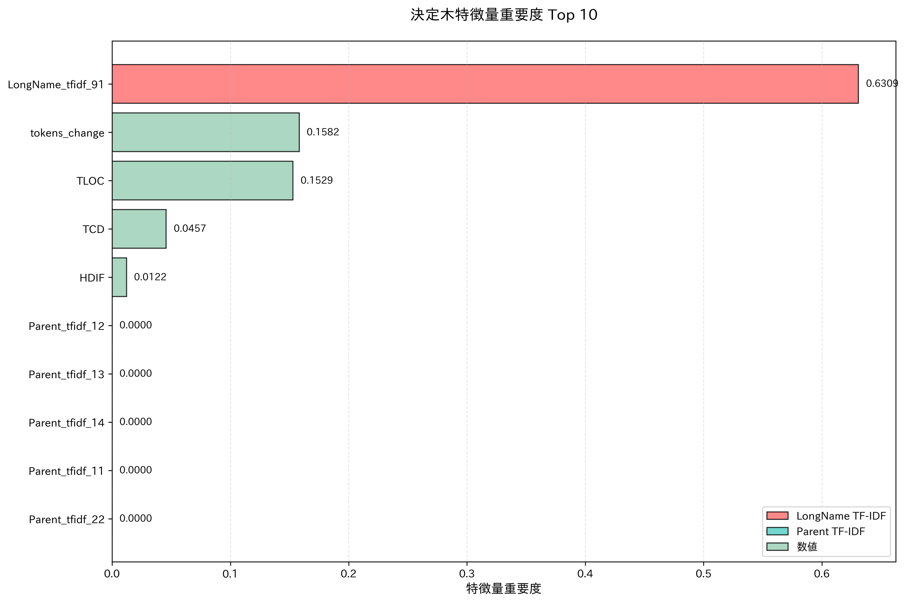

## 今週の活動
- それぞれのソフトウェアプロジェクトを分析
### antlr4
- 学習データ数: 164件（アンダーサンプリング後）
- テストデータ数: 169件
- マクネマー検定の結果
	- p値: およそ0.27
	- 有意差なし

| 指標（概算）    | 特徴量追加前 | 特徴量追加後 |
| :-------- | :----- | :----- |
| F1スコア     | 0.45   | 0.48   |
| Precision | 0.32   | 0.36   |
| Recall    | 0.76   | 0.76   |
| Accuracy  | 0.77   | 0.8    |
| ROC-AUC   | 0.82   | 0.87   |

#### 概要
- ParentやLongNameに含まれる特定の単語の重要度が高い
- メソッドのトークン数の変化が精度向上に寄与している
- HDIF、HNDB、HTRPなどのハルステッドメトリクスも重要

#### 概要
- 全体として分布の偏りが大きい
- 特定の領域に異なるクラスのデータポイントが密集することで、クラス間の分離が難しくなり、分類境界が曖昧になっている（モデルが細かな違いを学習できていない）

#### 概要
- トークン数の変化、HDIF、HNDB、NOS、HTRP、TNOS、HEFFは特定の範囲において陽性クラスの予測確率が高止まりしている
- NUMPAR、JUnit Rulesは凸型の変化が見られ、特定の値の前後では陽性クラスの予測確率が低下
- 全体として、特定の値以上か以下になると陽性クラスの予測確率が大きく増加

#### 概要
- LongNameに含まれる特定の単語の重要度が0.139以下 -> トークン数の変化量が-0.136以下のときにジニ不純度がおよそ0.19となり、陽性クラスを高い確率で分類している
- LongNameに含まれる特定の単語の重要度が0.139以下ではない -> TLOC（Total Lines of Code）が-0.05以下のときにジニ不純度がおよそ0.07となり、陰性クラスを高い確率で分類している
### ceylon-ide-eclipse
- 学習データ数: 828件（アンダーサンプリング後）
- テストデータ数: 426件
- マクネマー検定の結果
	- p値: およそ0.000001
	- 有意差あり

| 指標（概算）    | 特徴量追加前 | 特徴量追加後 |
| :-------- | :----- | :----- |
| F1スコア     | 0.39   | 0.49   |
| Precision | 0.30   | 0.40   |
| Recall    | 0.56   | 0.65   |
| Accuracy  | 0.57   | 0.67   |
| ROC-AUC   | 0.60   | 0.69   |

#### 概要
- コード行数の長さの変化は最も重要度が高い
- Maintainability Index関連のメトリクス（MI, MISEI, MIMS, MISM）も重要度が高い
- ハルステッドメトリクス（HNDB, HTRP, HCPL, HEFFなど）が引き続き上位に位置している

#### 概要
- Maintainability Index関連のメトリクスは分散が大きい
- ハルステッドメトリクス、コード行数やトークン数の変化量は分散が比較的小さいため、それぞれの特徴量のみでクラスを分類するのは難しい

#### 概要
- Maintainability Index関連のメトリクス、一部のハルステッドメトリクス（HCPL、HVOL、HDIF、HPL、HPV）は凹型のグラフになっており、特定の値付近で陽性クラスの予測確率が低くなり、その前後で陽性クラスの予測確率が高くなっている
- コード行数の変化、トークン数の変化、HNDB、HTRP、HEFFのいずれかの値を変化させても、陽性クラスの予測確率にはあまり変化が見られない

#### 概要
- コード行数の変化量が-0.037以下 -> メソッドに対する操作が「追加」 -> LongNameに含まれる特定の単語の重要度が0.339以下ではないときにジニ不純度がおよそ0.22となり、陽性クラスを高い確率で分類している
- コード行数の変化量が-0.037以下ではない -> HCPL（Halstead Calculated Program Length）が0.386以下のときにジニ不純度が0.08となり、陰性クラスを高い確率で分類している
### elasticsearch

## 得られた成果
## 直面した課題
## 来週の計画