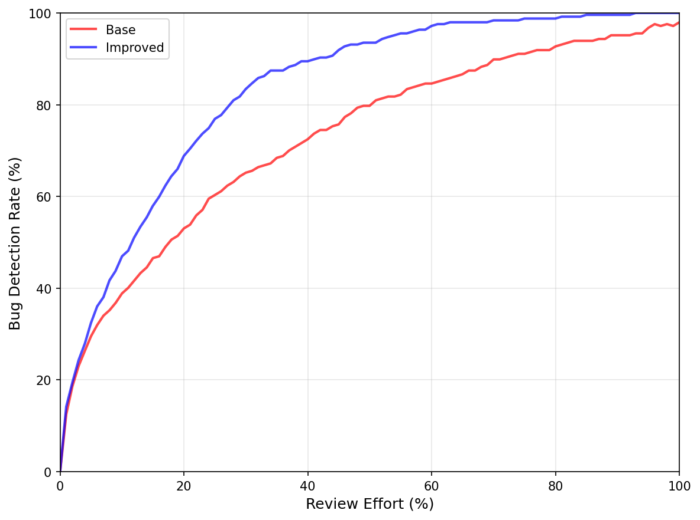
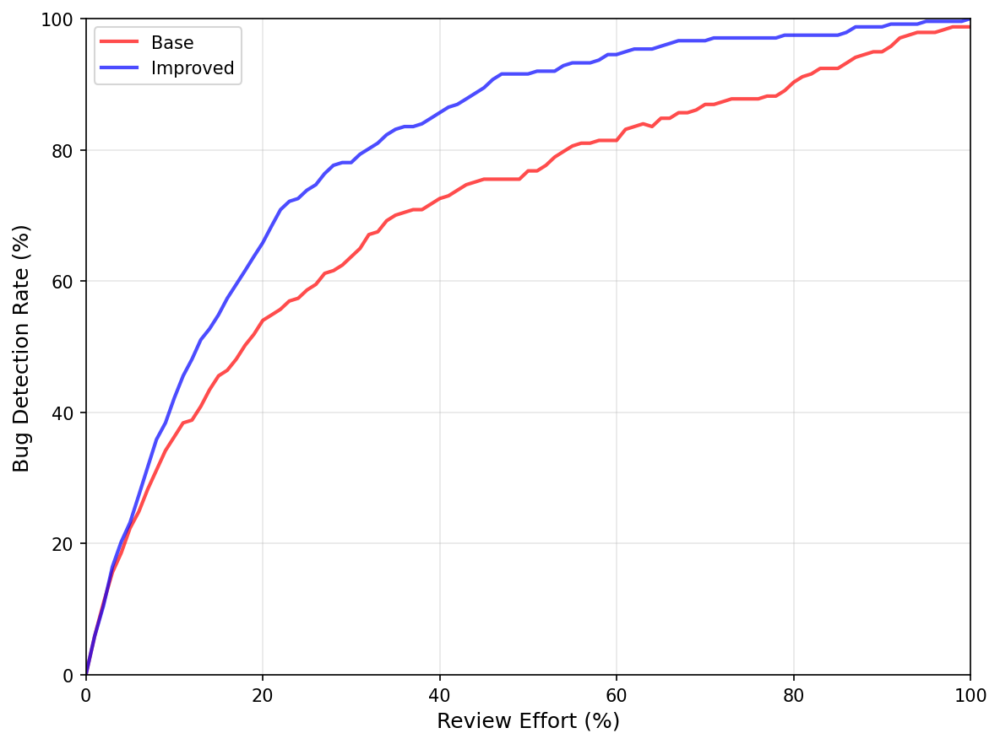

## 今週の活動
- 労力考慮型のレビュー労力測定手法を実装
	- 動的計画法
		- メモリ容量が足りず、プログラムが終了してしまった
	- 貪欲法
		- 数秒で処理が完了
	- 貪欲法を採用することにした
	- 労力の計算式
		- $C$: コードチャーン（変更コード行数）
		- $N$: 変更ファイル数
		- $H$: Entropy
		* ベース労力 $E_{raw} = C \times N^H$
			* 変更の大きさと分散度を考慮
		* 補正済み労力$E_{adj} = \ln(E_{raw} + 1)$
			* 対数変換を適用し、変更の大きさや分散度が労力に与える影響を小さくする
	* 密度の計算式
		* 密度はナップサック問題において、アイテムをどの順番で選ぶかを決めるための指標
		* 貪欲法では密度が高いものから順に選ぶ
		* $\hat{y}_i$: モデルが予測した、そのコミットのバグ混入確率（$0 \le \hat{y}_i \le 1$）
		* $E_{adj, i}$: そのコミットの補正済みレビュー労力
		* 密度$\text{D}_i = \frac{\hat{y}_i}{E_{adj, i}}$
## 得られた成果
- 労力考慮型モデルを用いた場合であっても、提案手法の方がより多くのバグをより少ない労力で検出できた
### Elasticsearch

### Hazelcast

### Neo4j

### Netty

### OrientDB

## 直面した課題
- 労力が非常に多いコミットが存在するため、全てのコミットの労力の和を容量（レビューに使える総労力）とするのは不適切
- 「コミットをレビュー労力の小さい順にソートし、そのうち上位80%のコミットの労力の和を容量とする」などの対策が必要
## 来週の計画
- 過去に使用したLaTeXテンプレートに従って論文の下書きを完成させる